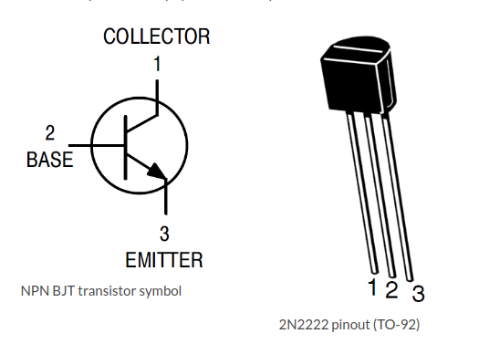

# ESP8266 LED & DHT22 Control with OTA Updates

This project demonstrates how to control an LED connected to an ESP8266 and read data from a DHT22 sensor using a web interface. It also supports over-the-air (OTA) updates using the **ElegantOTA** library, allowing you to upload new firmware to the ESP8266 without needing to connect it to a USB cable.

## Features

- Control an LED via a web interface.
- Turn the LED on for 30 seconds via a button click.
- Display temperature and humidity readings from the DHT22 sensor, which updates every 5 seconds.
- Over-the-air (OTA) firmware updates via the ElegantOTA interface.

## Components Required

- ESP8266 development board (e.g., NodeMCU, Wemos D1 Mini, etc.)
- DHT22 sensor (for temperature and humidity readings)
- LED connected to the D2 pin on the ESP8266 (or modify in code if using another pin)
- **2N2222 NPN Transistor** (for driving the LED)
- Resistors for the LED and DHT22 sensor (if necessary)
- External power source (if needed, depending on your LED and transistor setup)

## Libraries Required

- **ESP8266WiFi** (for Wi-Fi connectivity)
- **ESPAsyncWebServer** (to handle web requests)
- **DHT** (for reading from the DHT22 sensor)
- **ElegantOTA** (for OTA updates)

To install the required libraries, go to **Sketch** > **Include Library** > **Manage Libraries** in the Arduino IDE, and search for these libraries.

## Setup

### 1. Install Libraries

- **ESP8266WiFi**
- **ESPAsyncWebServer**
- **DHT**
- **ElegantOTA**

To install **ElegantOTA**, go to **Sketch** > **Include Library** > **Manage Libraries**, then search for `ElegantOTA` and install it.

### 2. Store Wi-Fi Credentials in `credentials.h`

Create a `credentials.h` file to store your Wi-Fi credentials. This file should be in the same folder as your main `.ino` file. The contents of `credentials.h` should look like:

```cpp
#ifndef CREDENTIALS_H
#define CREDENTIALS_H

// Replace with your network credentials
const char* ssid = "YOUR_SSID";
const char* password = "YOUR_PASSWORD";

#endif
```

This keeps your Wi-Fi credentials separate and secure.

### 3. Hardware Setup

- **LED and Transistor Setup**: 
    - The LED is controlled via a **2N2222 NPN transistor** to ensure that the ESP8266 does not directly drive the current for the LED.
    - Connect the **emitter** of the 2N2222 to **ground**.
    - Connect the **collector** of the 2N2222 to the **negative (cathode)** leg of the LED.
    - Connect the **positive (anode)** leg of the LED to a suitable power source (e.g., 5V, depending on your LED's specifications).
    - The **base** of the 2N2222 should be connected to the **D2 pin** of the ESP8266 through a **current-limiting resistor** (typically around 1kΩ).

- **DHT22 Sensor**: 
    - Connect the **VCC** and **GND** pins of the DHT22 to the 3.3V and GND pins of the ESP8266, respectively.
    - Connect the **data** pin to **D4** on the ESP8266 (or change in the code if you're using another pin).
    - Use a **4.7kΩ pull-up resistor** between the data pin and the 3.3V supply.

### 4. How to Identify the Pinout of the 2N2222 Transistor

The **2N2222** is an NPN transistor, and its pins are as follows:

- **Pin 1** (left leg when facing the flat side of the transistor) is the **Emitter** (E).
- **Pin 2** (middle pin) is the **Base** (B).
- **Pin 3** (right leg) is the **Collector** (C).

## 2N2222 Transistor Pinout

Here is a diagram showing the pinout of the 2N2222 NPN transistor:




- **Emitter (E)**: Connects to **Ground** (GND).
- **Base (B)**: Connects to the **D2** pin of the ESP8266 through a current-limiting resistor (typically around 1kΩ).
- **Collector (C)**: Connects to the **negative (cathode)** leg of the LED.

The **positive (anode)** leg of the LED should be connected to the **5V** supply (or suitable voltage based on your LED's requirements).

### 5. Upload the Code

Upload the code to your ESP8266 using the Arduino IDE.

### 6. Access the Web Interface

Once the ESP8266 connects to Wi-Fi, open the Serial Monitor. You will see the ESP8266's IP address. Use this IP to access the web interface on your browser. For example:

```
http://192.168.1.100
```

On the web page, you'll be able to:
- Turn the LED on and off.
- Turn the LED on for 30 seconds by clicking a button.
- View the current temperature and humidity from the DHT22 sensor, which will refresh every 5 seconds.

### 7. OTA Updates

To upload new firmware over the air, navigate to the following URL:

```
http://<ESP_IP>/update
```

Select a `.bin` file and upload it. Once the upload is complete, the ESP8266 will reboot with the new firmware.

## Code Explanation

### 1. Wi-Fi Setup

The ESP8266 connects to the Wi-Fi network using credentials stored in the `credentials.h` file.

### 2. Web Server

The ESP8266 runs a web server that serves:
- A home page with buttons to control the LED.
- Displays the current temperature and humidity from the DHT22 sensor.
- Updates the temperature and humidity every 5 seconds.

### 3. LED Control

The LED can be turned on and off using the buttons. There’s also an option to turn the LED on for 30 seconds using the "Turn LED ON for 30 Seconds" button. The LED is controlled through a **2N2222 NPN transistor**.

### 4. OTA Updates

Using the **ElegantOTA** library, the ESP8266 serves an OTA update page. By navigating to the `/update` endpoint, you can upload new firmware to the device.

## Troubleshooting

1. **ESP8266 not connecting to Wi-Fi:**
   - Double-check your SSID and password in `credentials.h`.
   - Make sure the ESP8266 is in range of your Wi-Fi network.
   - Restart the ESP8266 and try again.

2. **LED does not turn off after 30 seconds:**
   - Ensure that the `D2` pin is properly connected to the **base** of the 2N2222 transistor.
   - Verify that the LED and transistor are properly connected in the circuit.

3. **OTA not working:**
   - Make sure you're using the correct IP address for your ESP8266 in the browser.
   - Ensure that ElegantOTA is properly initialized (`ElegantOTA.begin(&server)` in the `setup()`).

## License

This project is open source. Feel free to modify and use it for your own needs.
